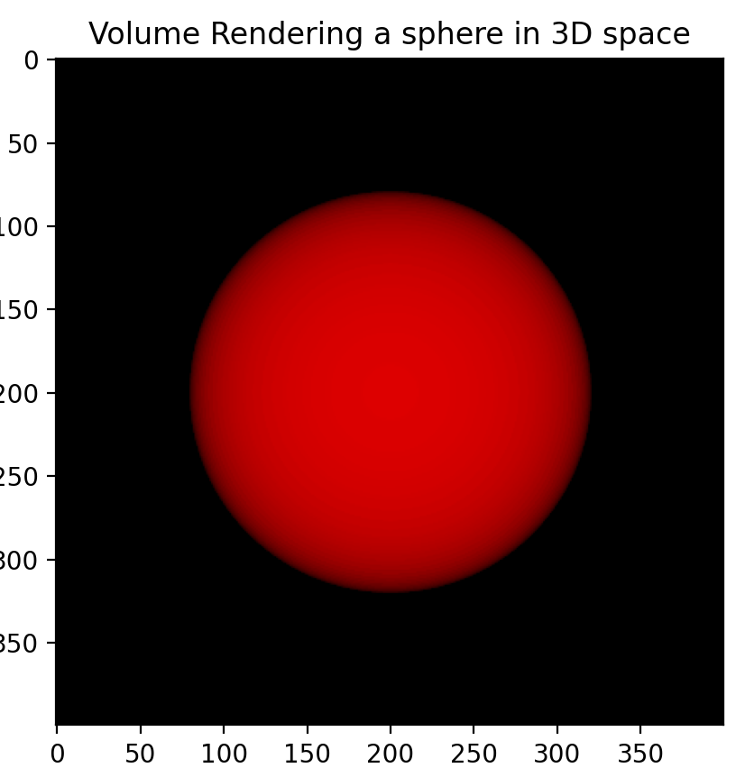

# NeRF Intuitions

In this repository contains a collection of scripts that I used to understand NeRF from the paper "NeRF: Representing Scenes as Neural Radiance Fields for View Synthesis", Ben Mildenhall, Pratul P. Srinivasan, Matthew Tancik, Jonathan T. Barron, Ravi Ramamoorthi, Ren Ng.

This set of scripts are based on the course NeRF from Maxime Vandergar that is shared on Udemy. Course highly recommended.
I hope the author does not mind that snippets of his code are used here. If so, please let me know that I will take this repositiory down.

As you can see, I don't use jupyter notebooks, I prefer to use scripts, because I think it is easier to understand the flow of the code and 
also it is easier to debug. I like a lot using ipdb to debug my code.

**How to follow this README? Please, open the README in one window and the scripts in another window, so you can follow the explanation of the code.**

The installation can be done via pixi.
Once this repo is cloned you can install the dependencies by running the following command:

```bash
pixi shell
pip install -r requirements.txt
```

## Part 1: Pinhole Camera

`standard_camera_model.py`

The course starts by explaining basic concepts of pinhole camera, and how to generate rays from the camera.


The script is pretty simple, it shoot rays from the camera to the scene that contains a sphere in the center.
The sphere is then rendered in the image plane.

The rendering is done by calculating the intersection of the ray with the sphere, and then calculating the color of the pixel based on the intersection point.
Basically the interction point is done by solving the following equation:

$(o_x + t * d_x - p_x)^2 + (o_y + t * d_y - p_y)^2 + (o_z + t * d_z - p_z)^2 = r^2$

where $o$ is the origin of the ray, $d$ is the direction of the ray, $p$ is the center of the sphere, and $r$ is the radius of the sphere.
and $t$ is the distance from the origin of the ray to the intersection point.
If the equation has a solution, then the pixel is colored with the color of the sphere.

Please run `python standard_camera_model.py` to see the result.

You should be able to generate an image like the one below.


As you can see the sphere does not look like a real 3d object, it looks like a circle, this is because we are not considering the perspective of the camera.
The goal was of this part of the course was just to create some building blocks to understand the NeRF model.


Just a side comment, of course this is a simple model, and in real world we have to consider the refraction of the light  and other factors that can affect the color of the sphere.
Also, for more complex shapes and objects, usually people build them as a mesh of triangles, and the intersection of the rays are computed using this mesh.

The next part we will see Volumetric Rendering, and how to render this sphere using volume rendering.

## Part 2: Volume Rendering

`volumetric_rendering.py`

In this part of the course few other pieces of code are added to the previous script to render the sphere using volume rendering.

First, the `intersect` method of the Sphere was changed a bit. Insted of checking if the ray intersects the sphere, a simple check is done to see if the ray is inside the sphere.
If it is inside, a color value is associated with this ray (returned in a vector of share [nb_rays, 3]).
Differently from the previous script, a density vector associated with the ray is also returned. As with the color, the density is associated with some value if the ray is inside the sphere. Its shape is [nb_rays, 1].

The second building block for NeRF is the volume rendering function.
This is done by integrating the color and density values of the rays that intersect the sphere.
This integral is carried out numerically by using the following equation:

$\hat{C}(r) = \sum_{i=1}^{N} T_i(1- \text{exp}(-\rho_i\delta_i))c_i$,

where $N$ is the number of bins the ray is divided (we are using the quadrature method for integration from $f_n$ to $f_t$), $\delta_i$ is the distance between the bins ($\rho_i=t_{i+1} - t_{i}$), $\rho_i$ is the density of the ray at the bin $i$, $c_i$ is the color of the ray at the bin $i$, and $T_i$ is the transmittance of the ray at the bin $i$.
The transmittance is calculated as $T_i = \text{exp}(\sum_{j=1}^{-i1}  -\rho_j\delta_j)$.

These functions are implemented in the functions `compute_transmittance` and `rendering` in the script `volumetric_rendering.py`.

This simple method allows use to render the above sphere in a more realistic way as you can see below.



One benefit of this rendering function using vollumetric rendering is that the function **is differentiable,** and can be plugged into a gradient descent optimization algorithm to optimize the parameters of a model.

For instance, also in this script, we optimized a simple sphere model using MSE loss function to find the best parameters to generate the same sphere as above
as you can see in the image below.


This diferentiable property is very important for the NeRF model, as we will see in the next part of the course.

## Part 3: Voxel model

`voxel_reconstruction.py`

In this part of the course, the author explains how to reconstruct a 3D object using a voxel model.
The voxel model is a 3D grid that represents the 3D object. Each voxel in the grid has a color and a density value associated with it.
The goal is to train a model to render this scene using the voxel model.

For this a database of 3D objects is used, which is the one store in the `fox` directory. In this one there are images of a fox from different angles.
The dataset contains the images and also the rotation and translation matrices of the camera that generated the image.

THe `get_rays` function is used to generate the rays shot from each camera to the scene. Each set of rays is associated with the image generated by the camera.
The function returns the origin and direction of the rays, and the image generated by the camera.

Also there we have the definition of the Voxel model (`Voxels` class) defining the simple parametric voxel model (with `N, N, N, 4`) dimensions that we are going to learn how
to render it.
Its intersection function is defined if the ray intersects the voxel, and the color and density of the voxel is returned.

Now we have all the elements to train a model able to render the scene using the voxel model.
The training_loop function is used to train the model using gradient descent to minimize the MSE loss function between the rendered image by the voxel model
and the image generated by the camera.
This is a simple optimization problem set on pytorch.
Follow below the result of the training for each epoch.


The voxel model while simple, is not very scalable, as the number of parameters to represent the model explodes with the resolution required to represent the 3D object.
This is where the NeRF model comes in, as we will see in the next part of the course.


## Part 4: NeRF

`nerf.py`

To jump from the voxel model to the NeRF model, is essentially pretty simple.
You just replace the voxel model with a neural network that is able to represent the scene at any resolution.
That's it.
Inputs to the network are the x, y, z, and the output is the density and color of the scene as we saw in the voxel model.

I will not place the NN used in the NeRF model here, you can look at the paper, but it is a simple MLP that takes the x, y, z, 

One thing that is important to hightlight in the NeRF is the importance of the positional encoding.
The positional encoding is used to encode the x, y, z coordinates of the scene in a way that the network can learn the spatial relationships between the points.
Apparently, the NeRF model is biased towards low frequency functions, and the positional encoding is used to "encode" the high frequency functions.
Actually there are several works on generative models for images that highlight the importance of some mechanism to regularize the model to learn high frequency functions.
For instance, myself implemented something [[[here](https://github.com/tiagofrepereira2012/fourier-features-python/)]](https://github.com/tiagofrepereira2012/fourier-features-python/).

Well, in the images below I show the result of the training of the NeRF model for the fox dataset with and without the positional encoding.
I'm training only for 4 epochs, because it takes forever to train this model.

You can run the file ```python nerf.py --help``` to see train the NeRF model.

Follow below the result of using the positional encoding for the first 4 epochs and the outcome of the training until 15 epochs.


and the result of the training without the positional encoding for the first 4 epochs and the outcome of the training until 15 epochs.


Bah, honestly, I don't see much difference between the two models. The one with positional encodin converged faster, but the final result is the same.
Maybe I need to take a dataset with more complex shapes to see the difference between the two models.

## Part 5: Rendering the triangle mesh

`mesh_extraction.py`

With the densities either estimated from the voxel model or the NeRF model, we can render the scene using the triangle mesh.
For this the author uses `mcubes` library to extract the mesh from the densities.

You can run the file `python mesh_extraction.py --help` to see the result of the mesh extraction for each one of the models.

Bellow follow the result of the mesh extraction for the voxel model and the NeRF model.


## Part 6: Adding colors to the mesh

**TO DO**

This part needs to be implemented, since I did not have time to implement it.
There are several strategies that we can use to color using a triangle mesh.
For instance, the simplest way is to use the normal of the triangle to color the triangle, and you can do this over
the whole mesh.


## Part 7: Using a library for this job

**TO DO**

Well, everything was implemented from scratch for learning purposes, but there are libraries that can do this job for you.
It would be nice to use [nerf_pl](https://github.com/kwea123/nerf_pl) or [nerf-studio](https://docs.nerf.studio/) to do this job.

Also it would be nice to use [tiny-cuda-nn](https://github.com/NVlabs/tiny-cuda-nn), in our current model to optimize the training of the model.
